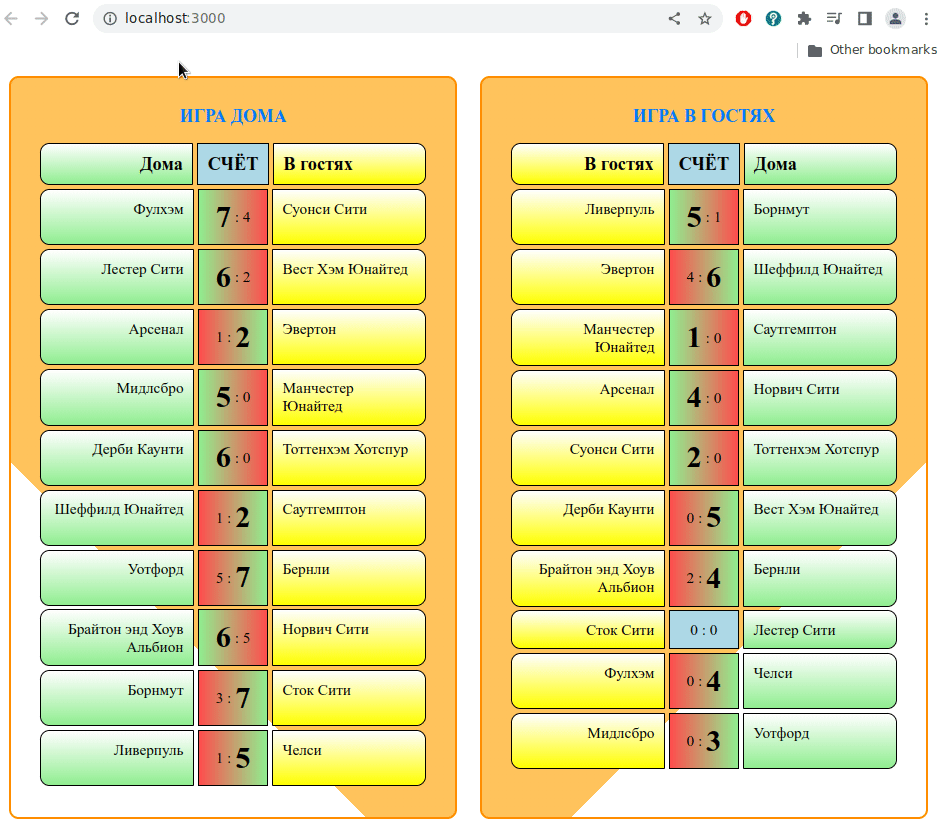

# Футбольный календарь

Страница на php, выводящая две карточки с играми: первая - игра дома, вторая - в гостях.  
Автоматизация, присутствующая на странице, выполнена на php и jQuery.  
С помощью php реализован:
- случайный выбор команд и команд соперников;
- случайный счет игры от 0 до 7 максимум.

С помощью jQuery реализовано:
- определение счета каждой игры и выполнение градиентной заливки фона блока счета от красного к зеленому цвету от проигравшей к выигравшей команде и увеличение шрифта счета выигравшей команды;
- заливка фона всех блоков выбранной команды на странице красным цветом.

После каждого обновления страницы счет и градиентная заливка фона обновляются.

### Внешний вид

Внешний вид страницы и обзор возможностей представлен на следующей анимации:

### Используемые технологии:

При написании страницы использованы следующие web-технологии:

- оформление выполнено с помощью flexbox;
- сборка проекта осуществлена с помощью gulp;
- jQuery подключен в файле gulpfile.js;
- для стилей использован scss-препроцессор;
- цвета страницы заданы с помощью переменных в файле variables.scss;
- для контроля версий файлов использован git;
- активный поиск ответов на вопросы на stackoverflow и google, а также в книгах O'Reilly.
